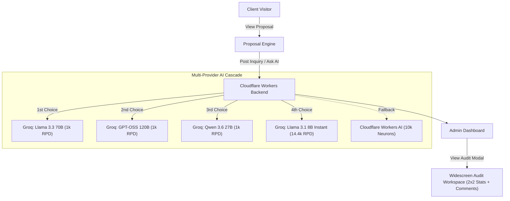

# NinuSoft

Marketing site for NinuSoft, deployed at [ninusoft.com](https://ninusoft.com).

## Stack

- **Frontend Core**: React 19 + TypeScript
- **Build Tool**: Vite (configured in [vite.config.ts](./vite.config.ts))
- **Styling**: Tailwind CSS v4 (with full custom transitions and styling in `src/index.css`)
- **Routing**: wouter (for single-page client-side routing)
- **State/Query Management**: `@tanstack/react-query`
- **UI & Components**: Radix UI primitives and shadcn-style components
- **Forms & Validation**: `react-hook-form` + `zod`
- **Phone Inputs**: `react-phone-number-input` (integrated with a custom Shadcn-styled `Select` country dropdown)
- **Animations**: `framer-motion` + custom CSS scale/fade keyframe animations

## Getting started

```bash
pnpm install
pnpm dev        # start dev server (http://localhost:8080)
pnpm build      # production build -> dist/public
pnpm serve      # preview the production build
pnpm typecheck  # TypeScript check, no emit
```

## Project structure

```
src/
  pages/        # route-level pages (e.g., [Home.tsx](./src/pages/Home.tsx), [not-found.tsx](./src/pages/not-found.tsx))
  components/   # reusable UI components (buttons, dialogs, sheets, toast, etc.)
  data/locales/ # localization dictionaries ([en.json](./src/data/locales/en.json) & [ar.json](./src/data/locales/ar.json))
  hooks/, lib/  # custom hooks (e.g. use-toast) and utility libraries (e.g. cn)
public/
  apps/         # static per-app pages (e.g., privacy policies) served verbatim
```

The app is a single-page site ([App.tsx](./src/App.tsx), routed with `wouter`). Most content lives in one long [Home.tsx](./src/pages/Home.tsx) page with in-page sections linked from the navigation bar.

## Features

### 1. Localization (i18n) & RTL Support
The site is fully bilingual (English and Arabic) and supports Right-to-Left (RTL) layout rendering. 
- Translations are managed dynamically using dictionaries in [src/data/locales/](./src/data/locales/).
- Input fields (such as phone numbers and emails) automatically lock to Left-to-Right (LTR) text direction for optimal readability.

### 2. Contact Form & API Integration
The "Contact Us" dialog on the home page gathers user details (name, email, phone number, project type, and description) and submits the payload to a serverless backend proxy:
- **API Endpoint**: `https://contact-api.ninusoft.workers.dev/` (Cloudflare Worker)
- **Phone Input**: Dynamically formatted using the custom country-select selector based on standard international dial codes.

### 3. Static App Pages
`public/` is copied as-is into the build output. App-specific static pages (such as privacy policies) reside under `public/apps/<app-name>/` (e.g., [apps/](./public/apps/)) and are reachable at `https://ninusoft.com/apps/<app-name>/...` once deployed.

Currently, the following app privacy policies are available:

| App Name | Source File | Deployed URL |
| :--- | :--- | :--- |
| **Balance Recharger** | [privacy-policy.html](./public/apps/balance-recharger/privacy-policy.html) | [Open Link](https://ninusoft.com/apps/balance-recharger/privacy-policy.html) |
| **Hindam Customer** | [privacy-policy.html](./public/apps/hindam-customer/privacy-policy.html) | [Open Link](https://ninusoft.com/apps/hindam-customer/privacy-policy.html) |
| **Hindam Manager** | [privacy-policy.html](./public/apps/hindam-manager/privacy-policy.html) | [Open Link](https://ninusoft.com/apps/hindam-manager/privacy-policy.html) |

### 4. Private Markdown Proposals & Client Engagement Engine

The site includes an advanced client proposal viewing engine and internal admin dashboard:

- **Client Links**: `https://ninusoft.com/proposals/<private-token>`
- **Admin Control Panel**: `https://ninusoft.com/admin`
- **Per-Proposal Custom Settings**: Cross-device sync of signature methods (draw, type, upload), inline comments, expiry countdown, print/PDF export, rejection controls, and discount toggle.
- **Admin Discount Manager ("الخصومات") & Promo Code Box**: Dedicated admin category for managing proposal discounts (`percentage` or `fixed_amount`); clients can enter promo codes with real-time total recalculation.
- **Widescreen 2-Column Audit Engagement Modal (`1440px x 900px`)**:
  - Integrated header with clickable tracking URL, copy link button, and discount status badge.
  - 2x2 Engagement Stats Grid (`Open Count`, `Full Read`, `First Visit`, `Last Active`).
  - Comment status filter tabs (`الكل`, `قيد المراجعة`, `تم الحل`) with full vertical space utilization.
- **Multi-Provider AI Assistant (Groq Cloud API & Workers AI Fallback)**:
  - 1-click admin smart reply drafting and interactive proposal AI chat assistant.
  - High-speed Groq API model cascade (`llama-3.3-70b-versatile` -> `openai/gpt-oss-120b` -> `qwen/qwen3.6-27b` -> `openai/gpt-oss-20b` -> `groq/compound` -> `llama-3.1-8b-instant`) with up to 18,000 free daily requests.
  - Automatic fallback to Cloudflare Workers AI (`@cf/meta/llama-3.3-70b-instruct-fp8-fast`) if limits are reached.
- **Rejection Recovery & Exit-Intent Survey**: Converts proposal rejections into interactive negotiation requests (installment options, scope adjustments, or technical inquiries).
- **Telegram-style Quote Jump & Flash Highlight**: Clickable comment quote boxes that scroll to and pulse-highlight target text in the proposal.
- **Internal Notes & Comment Locking**: Lock answered comments against modification and keep private internal admin notes.
- **Audio Chime & Desktop Push Notifications**: Background auto-polling alerts when clients post new inquiries.



## Deployment

Pushing to the `main` branch triggers the GitHub Actions workflow in `.github/workflows/deploy.yml`, which builds the site and publishes the `dist/public` folder to GitHub Pages under the custom domain configured in `CNAME` (`ninusoft.com`).
